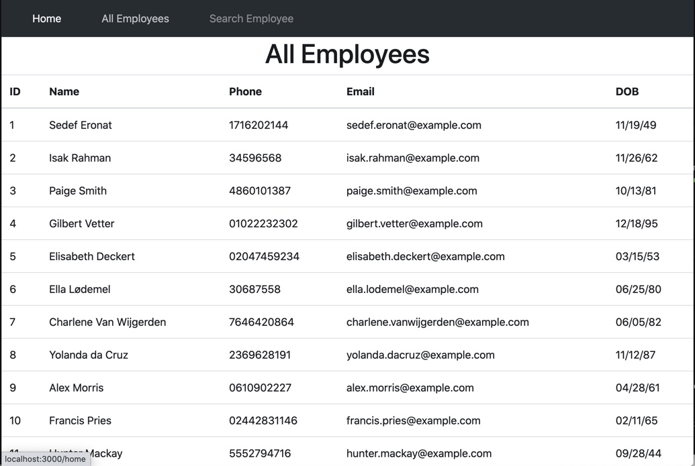

# Employee Directory

# Table of contents
1. [Project Description](#description)
2. [Usage](#usage)
3. [UI](#ui)
4. [Technologies](#technologies)
5. [Contact](#contact)

----

## Project Descripton <a name="description"></a>
This application was designed using React to help management search/sort through employee information quickly and easily.  

## Usage <a name="usage"></a>
To install dependencies run ```npm i```

To start application, run ```npm start```

## UI <a name="ui"></a>



## Technologies Used <a name="technologies"></a>

-React.js

## Contact <a name="contact"></a>
Github Username: [@sleepytomatoes](https://www.github.com/sleepytomatoes)\
Email: shaunadunn1@gmail
